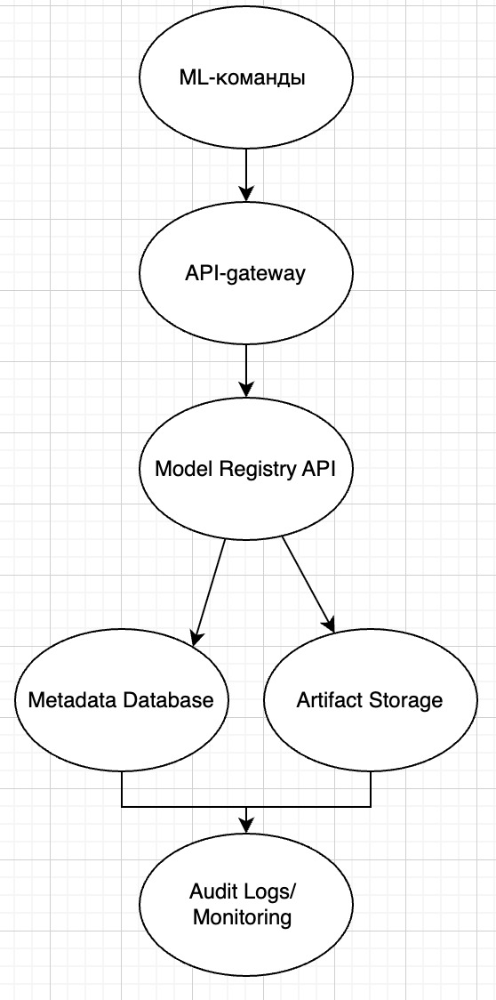

# Сетап

Дано несколько ML-команд, которые обучают модели и складывают их в директорию на определенную машинку. 

Текущее состояние хаоса представляет собой примерно такую структуру:

models/

models/mlds_1/my_model_v1/

models/mlds_3/sft_modell_v_123/

models/mlds_180/model_v1_v0_with_rank_dataset_0/

models/mlds_180/model_v1_v0_with_rank_dataset_1/

models/mlds_180/model_v1_v0_without_rank_dataset_0/

models/mlds_180/model_v1_v0_without_rank_dataset_1/

# Проектирование model registry

## 1. Существующие проблемы: 
    1) Отсутствие единого стандарта именования и структуры папок: названия папок содержат полезную информацию и для небольшого эксперимента автора вполне понятны. Однако при росте количества моделей, смене людей в команде и необходимости автоматизации/поиска/сравнения они становятся источником проблем из-за неоднородности форматов, отсутствия строгой иерархии.
    2) Полное отсутствие метаданных и контекста. Кто обучал? когда обучали? на каком датасете? какие метрики? какие гиперпараметры? описание эксперимента
    3) Отсутствует нормальное версионирование: вроде как в названии папок добавлены какие метки про версии, но это совершенно непонятно, что значит, почему например там  написано v1_v0, отсутствует хронологический порядок. Это все приводит к возможным перезаписям предыдущих версий и невозможности отслеживания эволюции модели
    4) Отсутствие концепции жизненного цикла модели: нет понятия стадий - development, staging, production, archived. Из-за этого будет непонятно, какую модель надо использовать в проде.
    5) Технические и операционные риски хранения. 
    Все модели хранятся на одной машине - если диск выйдет из строя или машина будет скомпрометирована, все модели будут потеряны. Любой пользователь системы может удалить или изменить модели другой команды. 
    6) Сложность масштабирования: по мере роста числа команд и моделей навигация по файловой системе становится невыносимой, десятки тысяч папок приводят к деградации производительности файловой системы.

## 2. Требования к системе 

    Функциональные требования: 
    1) Стандартизированное хранение : система автоматически генерирует уникальный идентификатор для каждой версии модели и определяет физический путь хранения артефактов, скрывая внутреннюю структуру от пользователя.
    2) Регистрация модели с метаданными
    3) Версионирование моделей
    4) Управление жизненным циклом - каждая версия модели может иметь статус: development, staging, production, archived. 
    5) Получение модели и её артефактов
    6) Аудит действий - система логирует все операции, изменяющие данные

    Нефункциональные требования:
    1) Надёжность хранения - артефакты моделей должны храниться в отказоустойчивом хранилище
    2) Доступность - API системы должно быть доступно не менее 99.5% времени
    3) Масштабируемость - система должна горизонтально масштабироваться: компоненты должны допускать увеличение нагрузки путём добавления ресурсов
    4) Безопасность - доступ к API должен быть защищён
    5) Производительность
    6) Эксплуатация - отвечает за то, чтобы система не просто работала, а чтобы её можно было легко наблюдать, быстро чинить и поддерживать в продакшене без постоянных ночных звонков и хаоса.

## 3. Архитектура

    Компоненты: 

    1) API Gateway - централизованная точка входа, необходима для безопасности и возможности масштабирования. Технология - nginx
    
    2) Model Registry API. Функции: регистрация модели; создание версии; загрузка артефактов; изменение стадии; получение метаданных; аудит. Бизнес-логика должна быть централизована. Технология FastAPI, потому что лёгкая интеграция с ML-экосистемой, быстрый старт, async, OpenAPI из коробки.
    
    3) Хранилище метаданных. Тип: реляционная БД PostgreSQL. Данный выбор обусловлен необходимостью обеспечения транзакционности, поддержания строгих связей между сущностями (модель, версия, стадия, пользователь, аудит) и гарантированной целостности данных. В контексте model registry критично обеспечить невозможность одновременного существования нескольких production-версий и предотвратить неконсистентные состояния, что проще и надёжнее реализуется в реляционной модели с ограничениями и транзакциями.
    
    4) Артефакты моделей размещаются в объектном хранилище, совместимом с Amazon S3 API. Разделение хранения метаданных и бинарных файлов продиктовано требованиями масштабируемости и надёжности. Реляционная база данных не предназначена для эффективного хранения больших бинарных объектов, тогда как объектное хранилище обеспечивает отказоустойчивость, горизонтальное масштабирование и экономически эффективное хранение больших объёмов данных.
    
    5) Аудит и мониторинг. Логи: кто создал модель, кто перевёл в production, кто скачал.Мониторинг - метрик API, latency, ошибок. Технологии Grafana, Prometheus

## Схема базы данных

    Основные сущности:

    1. Model

    Сущность Model представляет логическую модель как единицу управления.

    Поля:
    id (PK)
    name
    description
    created_at
    created_by (FK - User)

    2. ModelVersion

    Сущность ModelVersion представляет конкретную версию модели.
    Поля:
    id (PK)
    model_id (FK - Model)
    version_number
    stage
    artifact_uri (путь в S3-совместимом хранилище)
    metrics (JSONB)
    created_at
    created_by (FK - User)
    
    3. User

    Сущность User хранит информацию о пользователях системы.
    Поля:
    id (PK)
    email
    role
    created_at

    4. AuditLog

    Сущность AuditLog предназначена для фиксации действий, изменяющих состояние системы.
    Поля:
    id (PK)
    entity_type (model / version)
    entity_id
    action (create / update / promote / delete)
    performed_by (FK - User)
    timestamp

    Логическая структура связей:

    Model (1) - (N) ModelVersion
    User (1) - (N) Model
    User (1) - (N) ModelVersion
    ModelVersion (1) - (N) AuditLog

## Проектирование API

    API проектируется в соответствии с REST-принципами. Обмен данными осуществляется в формате JSON. Спецификация интерфейса описывается в стандарте OpenAPI и автоматически генерируется на основе реализации сервиса

    Основные эндпоинты:

        Работа с моделями:

        POST /models
        Создание новой модели.
        GET /models
        Получение списка моделей с возможностью фильтрации.
        GET /models/{model_id}
        Получение информации о конкретной модели

        Работа с версиями:

        POST /models/{model_id}/versions
        Создание новой версии модели.
        Возвращает идентификатор версии и ссылку для загрузки артефакта.

        GET /models/{model_id}/versions
        Получение списка версий модели.
        
        GET /models/{model_id}/versions/{version_id}
        Получение информации о конкретной версии.
        
        PATCH /models/{model_id}/versions/{version_id}
        Изменение стадии жизненного цикла версии.
        
        GET /models/{model_id}/production
        Получение текущей production-версии модели.

        Работа с артефактами:

        GET /models/{model_id}/versions/{version_id}/download
        Возвращает временную ссылку на загрузку артефакта из S3-совместимого хранилища.